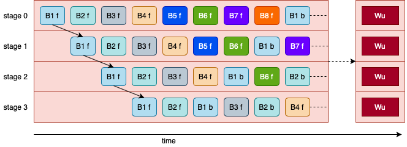
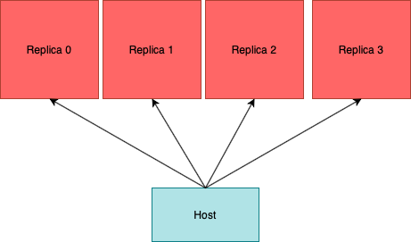

# IPU options

IPU 사용 시 옵션을 효율적으로 사용해야 최적의 성능을 이끌어 낼 수 있습니다. 주로 사용하는 세가지 옵션의 특징을 설명합니다.   
`GPUvsIPU` mnist를 GPU와 IPU 환경에서 구현하였습니다.   
각각 학습 및 검증에서 사용되는 데이터의 shape을 통해 batch size를 확인하여 IPU option이 어떻게 작용하는지 확인합니다.

|poptorch|torch|torchvision|python|
|------|---|---|
|IPU|32|-|
|GPU|32|2048|

`mini batch size` GPU에서 사용하는 배치사이즈입니다.   
`global batch size` IPU에서는 기존 배치사이즈를 IPU에 효율적으로 분배하기 위한 option을 사용하며 이를 통해 mini batch 단위로 이루어지는 여러 작업을 한번에 수행하는 최종 배치 사이즈를 확인할 수 있습니다.   

## gradientAccumulations

</img>
`Training.gradientAccumulation(n)`은 gradient를 계산할때 파이프라인을 구성하여 여러 단계로 분할하여 가중치를 업데이트합니다.   
n개의 미니 배치 사이즈 단위로 계산을 진행하여 누적된 기울기를 통해 가중치를 업데이트합니다. 즉, 미니 배치 사이즈가 k라면 nxk 단위가 구성됩니다.

## deviceIteration

</img>
device iteration은 훈련 루프의 한번의 반복에 해당하는 단위입니다. 즉, 한번에 작업할 양을 정의합니다.

## Replication

</img>
학습할 때 모델을 개수만큼 복제하여 한번에 학습하도록 도와주는 옵션입니다. 즉, Replication을 4로 주면 4개의 모델에서 한번에 학습을 진행합니다.